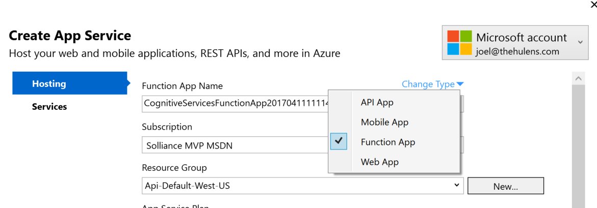
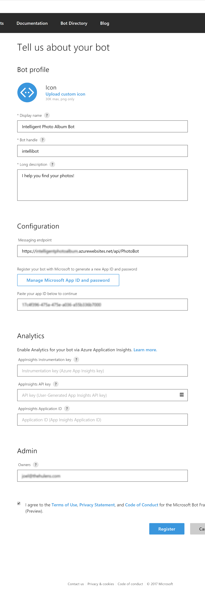
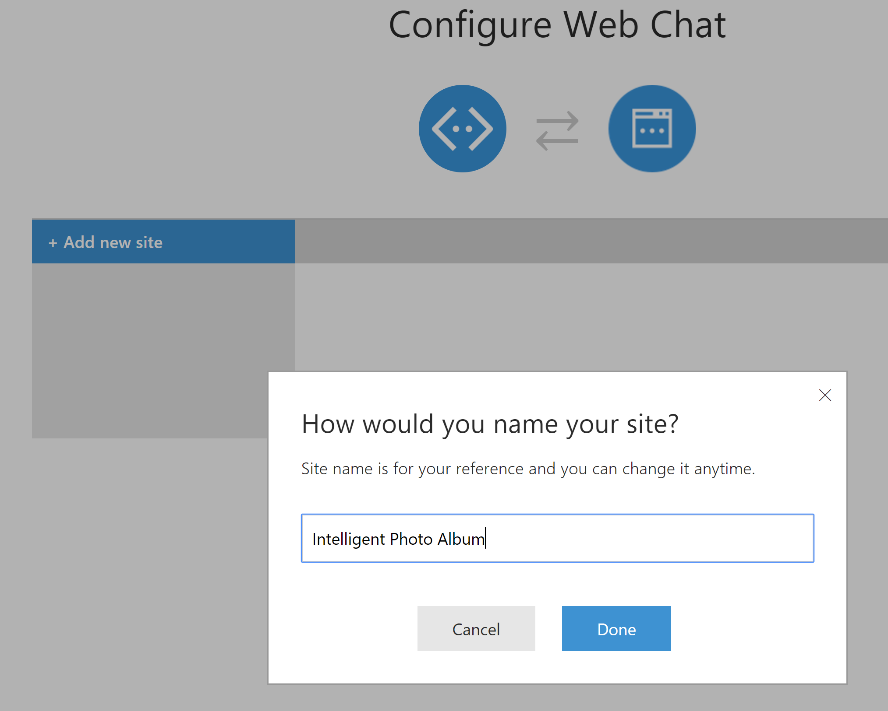
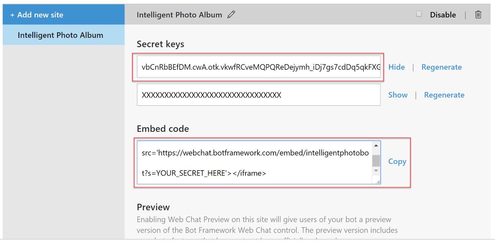

## Intelligent Album

Here’s the breakdown of the Visual Studio solution
(FaceIdentificationProcessor) by project:

1.  FaceIdentificationProcessor
    1.  Console application run locally against files located in a
        folder (identified in the TrainingImagesPath appSettings
        key value) to train the Cognitive Services Face API to identify
        specific people’s faces. Subfolders’ names will be used to tag
        people within, and should be named by person (Example:
        C:\\Pictures\\Training\\Bill Gates\\).
    2.  Extensively uses the CognitiveServiceHelpers class library to
        make API calls. Performs the following steps:
        1.  Load any registered person groups from the Face API
        2.  Create new person group, if needed
        3.  Add people’s faces from training images stored in file
            system
        4.  Executes training job
2.  CognitiveServiceHelpers
    1.  Portable class library that centralizes Cognitive Services API
        calls, provides models for transporting trained data, implements
        retry logic when API calls fail due to throttling, etc.
    2.  Abstracts service calls to the Face API and Computer Vision API
3.  PhotoAlbum.DTO
    1.  Portable class library containing DTO objects for SQL and ADLA
        data sets
4.  PhotoAlbum.Data
    1.  Data layer for executing queries against Azure SQL database.
    2.  Uses the very lightweight Dapper ORM.
5.  CognitiveServicesFunctionApp
    1.  App Services project that contains both Azure Functions,
        allowing users to run Azure Functions locally, and publish to
        Azure as pre-compiled assemblies for reduced warm-up time.
    2.  IdentifyFacesForAlbum
        1.  Azure Function with Blob trigger that executes Face and
            Computer Vision API calls (through the
            CognitiveServiceHelpers library) on images as their uploaded
            to Blob storage.
        2.  Sends object graph to the SaveAlbumImageData function for
            storage retention.
    3.  SaveAlbumImageData
        1.  Serializes the image data received from the
            IdentifyFacesForAlbum function, into JSON format and saves
            one file per image into an ADLS directory within time-sliced
            folders (partitioned in 15 minute increments).
6.  PhotoAlbum.Web
    1.  ASP.NET MVC website used for browsing the intelligent
        photo album.
    2.  Provides tag-based photo browsing, as well as browsing by
        friend’s names, based on photos that have positive facial
        recognition hits.
    3.  Includes a Bot that will find pictures of friends or from tags.
7.  PhotoAlbumActivity
    1.  U-SQL project containing environment configuration scripts for
        ADLA, as well as script used for the custom U-SQL ADF activity.
        1.  CreateTables.usql (Run 1st)
            1.  Creates the Data Lake database and tables
        2.  RegisterAsm.usql (Run 2nd against local and
            remote environment and newly created database)
            1.  Registers custom assemblies that the custom activity
                script will use
        3.  ProcessImageData.usql
            1.  Creates a U-SQL stored procedure which extracts and
                processes JSON-formatted files containing image and
                analytics data and stores result into Data Lake tables
        4.  QueryTables.usql
            1.  Methods for executing the ProcessImageData stored
                procedure and truncating tables.
            2.  Used for local testing and clearing of tables.

**Other files within solution folder:**

1.  AzureFiles
    1.  ADFTemplates
        1.  Contains json files for the ADF datasets, linked services,
            and pipeline:
            1.  Dataset\_InputDataset.json
                1.  Serves up the photo metadata from ADLS in json
                    format, generated by the SaveAlbumImageData
                    Azure Function. Includes json file structure
                    definition and time slice partitioning.
            2.  Dataset\_OutputDataLakeTable.json
                1.  The output dataset of the ADLA pipeline activity.
            3.  Dataset\_OutputDataset.json
                1.  The output dataset of the copy pipeline activity.
            4.  LinkedService\_AzureDataLakeAnalyticsLinkedService.json
                1.  ADLA linked service used by the ADLA
                    pipeline activity.
            5.  LinkedService\_Destination-SQLAzure.json
                1.  SQLAzure linked service used by the OutputDataset.
            6.  LinkedService\_Source-DataLakeStore.json
                1.  ADLS linked service used by the InputDataset and
                    OutputDataLakeTable datasets.
            7.  Pipeline\_CopyPipeline.json
                1.  Includes a copy activity whose source is the
                    AzureDataLakeStoreSource, and traverses the photo
                    metadata json files and sends them to Azure SQL via
                    the InsertJSONData stored procedure.
                2.  Also includes a Data Lake Analytics U-SQL activity
                    that executes the ProcessImageData U-SQL stored
                    procedure with the photo metadata json files within
                    the executing time slice.
    2.  SQL
        1.  Database.sql
            1.  Database and database object creation script. Creates
                the following:
                1.  Database: PhotoAlbum
                2.  Tables:
                    1.  Image
                    2.  ImagePerson
                    3.  ImageTag
                3.  Stored Procedure: InsertJSONData
                4.  User-Defined Table Type: ImageType
2.  Pictures.zip
    1.  Extract training and sample photos to C:\\Pictures\\
3.  Assemblies
    1.  Contains two DLLs that are required for U-SQL
        assembly registration. After installing the Data Lake Tools for
        Visual Studio
        (<https://www.microsoft.com/en-us/download/details.aspx?id=49504>),
        there will be a directory created under your Windows user’s
        AppData folder. You may have to update your Windows Explorer
        settings to show hidden directories. Copy the files here:  
          
        C:\\Users\\&lt;your
        username&gt;\\AppData\\Local\\USQLDataRoot\\assemblies

**Running the demo:**

1.  Make certain you have the training images saved on your hard drive
    (default: C:\\Pictures\\Training)
2.  Run the FaceIdentificationProcessor project from Visual Studio to
    identify and train the images
3.  Debug the CognitiveServicesFunctionApp locally (make sure the
    prerequisite environment steps are completed first) (This is
    optional, because the Functions are published to Azure and
    currently running)
4.  Connect Azure Storage Explorer to the blob storage account and
    upload sample images to the Uploads container.
    (BillGates-JonShirley.jpg will be tagged with Bill Gates, and
    signs.jpg will be tagged with Mel Gibson). All images will be
    described and tagged, but only images that contain trained person
    images will be identified as that person(s)
5.  Look at the PhotoData folder in ADLS, which should contain the json
    files
6.  Execute the ProcessImageData.usql script against the ADLA server to
    extract the image data and store it within the ADLA tables

**High-level flow of completed project:**

\[train local images\] -&gt; \[fileShare\] --&gt; \[adf\] --&gt;
\[blob\] --&gt; \[function\] --&gt; \[function\] --&gt; \[file in adls\]
--&gt; \[adf\] --&gt; \[adla\] --&gt; \[SQL\]

**Prerequisites and general notes:**

1.  Unzip Visual Studio Solution to your local drive
2.  Unzip sample pictures to your local drive (Default
    location: C:\\Pictures)
3.  Visual Studio 2015 Community or greater
4.  Install Data Lake Tools for Visual Studio
    <https://www.microsoft.com/en-us/download/details.aspx?id=49504>
5.  Azure 2.9.6 .NET SDK
    <https://go.microsoft.com/fwlink/?LinkId=518003&clcid=0x409>
6.  Visual Studio Tools for Azure Functions (VS 2015 only)
    <https://aka.ms/azfunctiontools>
7.  Provision Azure resources:
    1.  Blob Storage
    2.  Azure Data Factory
    3.  Azure Data Lake Analytics (also creates the Azure Data Lake
        Storage account)
    4.  Azure SQL database (PhotoAlbum)
    5.  Cognitive Services Face API
    6.  Cognitive Services Vision API
    7.  Azure Functions (created when deploying Visual Studio
        CognitiveServicesFunctionApp project)
    8.  Azure App Service (created when deploying
        PhotoAlbum.web project)
    9.  Azure Active Directory registered app named ‘PhotoAlbum’
        1.  Home page URL (reply URL):
            <https://contoso.example.com/application>
        2.  Add PhotoAlbum as a contributor to the Azure Data Lake
            Storage account via Access control (IAM)
8.  Update Visual Studio configuration files:
    1.  CognitiveServicesFunctionApp (appsettings.json)
        1.  AzureWebJobsStorage
            1.  Blob storage connection string
        2.  UploadBlobStorage
            1.  Blob storage connection string
        3.  FaceApiKey
            1.  Cognitive Services Face API key
        4.  VisionApiKey
            1.  Cognitive Services Vision API key
        5.  SaveAlbumImageDataUrl
            1.  Set to localhost for debugging. Configure app settings
                for the IdlkentifyFacesForAlbum function app in Azure
                with the published URL. Format is:
        6.  DatabaseConnectionString
            1.  Connection string to the Azure SQL PhotoAlbum database
        7.  ADLSAccountName
            1.  The Azure Data Lake Storage account name
        8.  SubId
            1.  The subscription Id of the Azure subscription where the
                Azure Active Directory account is located (Guid)
        9.  WebApp\_ClientId
            1.  The Application Id of the PhotoAlbum Azure Active
                Directory registered app (Guid)
        10. ClientSecret
            1.  Generated from a Key that the user creates within the
                PhotoAlbum Azure Active Directory registered app
        11. Domain
            1.  The Azure Active Directory domain
    2.  FaceIdentificationProcessor (App.config)
        1.  FaceApiKey
            1.  Cognitive Services Face API key
        2.  WorkspaceKey
            1.  Generate a new GUID for this
        3.  PersonGroupName
            1.  Default value is “People”
        4.  TrainingImagesPath
            1.  Local file path to the facial recognition
                training photos. Default value is
                “C:\\Pictures\\Training\\”
    3.  PhotoAlbum.Web (Web.config)
        1.  DatabaseConnectionString
            1.  Connection string to the Azure SQL PhotoAlbum database
        2.  AzureReader2
            1.  Set the connectionString value to the Blob storage
                connection string
            2.  Set the endpoint value to “http://&lt;blob storage
                account name&gt;.blob.core.windows.net/”

				 

Azure Functions from a web app (to more easily include custom DLLs):

<https://blogs.msdn.microsoft.com/appserviceteam/2017/03/16/publishing-a-net-class-library-as-a-function-app/>

Install Azure Functions CLI:
<https://www.npmjs.com/package/azure-functions-cli> (Make sure you’re
using Node version 6.x LTS or later)

npm i -g azure-functions-cli

 

When publishing the Function App from Visual Studio, be sure to change
the type in the Hosting tab:

 

Set the app settings for the Azure Function. When setting the
SaveAlbumImageDataUrl value, make sure to append the function key to the
end of the URL (example:
<https://cognitiveservicesfunctionapp.azurewebsites.net/api/SaveAlbumImageData?code=VrqjhQeg8q544GuKKtS9QHsZyRBG1y3Id38UUfGAHibzunZJBCKIUA==>)

 

You can find the function key for that function in the manager:

**Configuring the bot:**

Register your bot here: <https://dev.botframework.com>

 

 

Configure Web Chat for the bot. Add your site name:

 

Copy the secret key and the iFrame embed code. Paste in the bot page on
the website and replace YOUR\_SECRET\_HERE in the embed code with the
secret key. \*\* If the 1st secret key doesn't work, try the other one.

